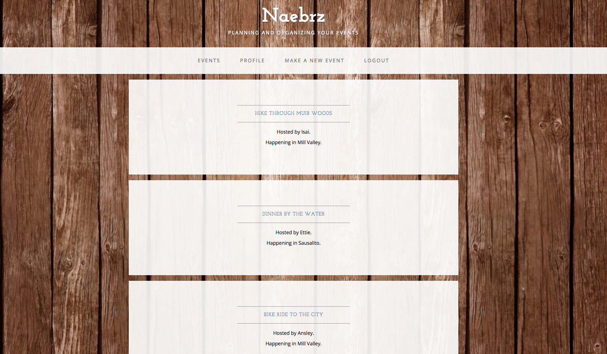
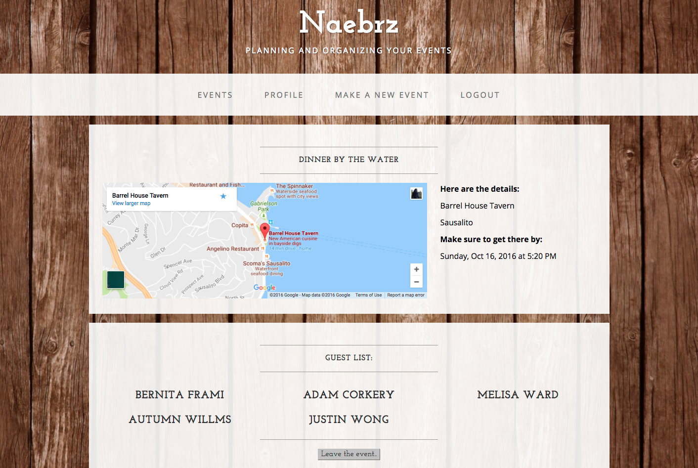
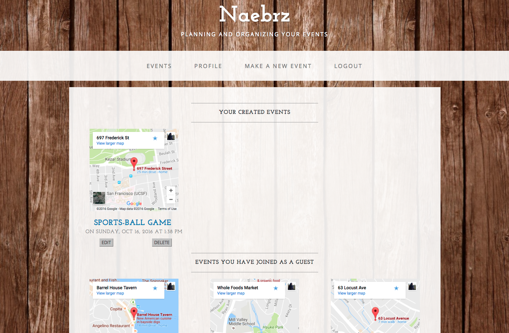

# Naebrz!

## At Naebrz, you can create, organize, and monitor events.  It's as simple as:

1. Sign up
2. Create an event
3. Watch your guestlist grow on your events and join other events!

## User Stories:

* A user can create events
* A user can view/join events

## Screenshots

## Future features:

1. Allow an event creator to limit the total number on the guestlist
2. Allow an event user to send out confirmation emails
3. Allow for items, gifts, etc to be coordinated and brought to an event
4. Allow Google calendar invites

## Usage:

Clone or download the repo
Run 'bundle install' to install all dependency gems
Run 'bundle exec rake db:create, bundle exec rake db:migrate, bundle exec rake db:seed (optional)'
Finally, run 'bundle exec shotgun' and fire up your browswer to http://localhost:9393

or

visit http://naebrz.herokuapp.com
